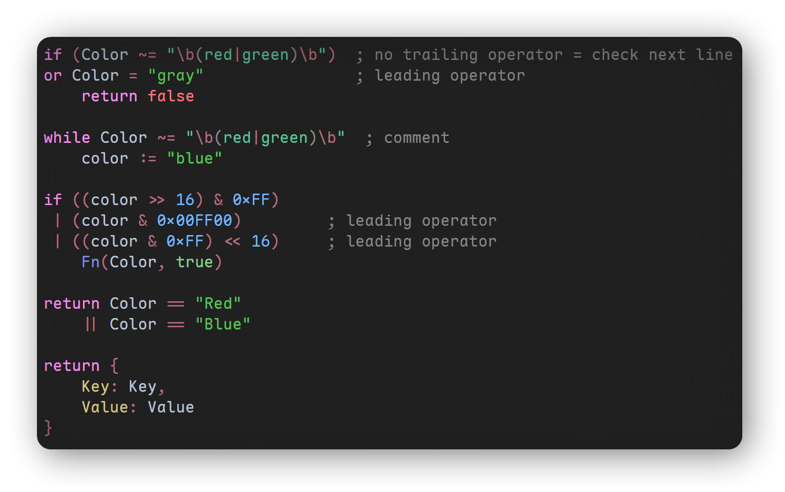
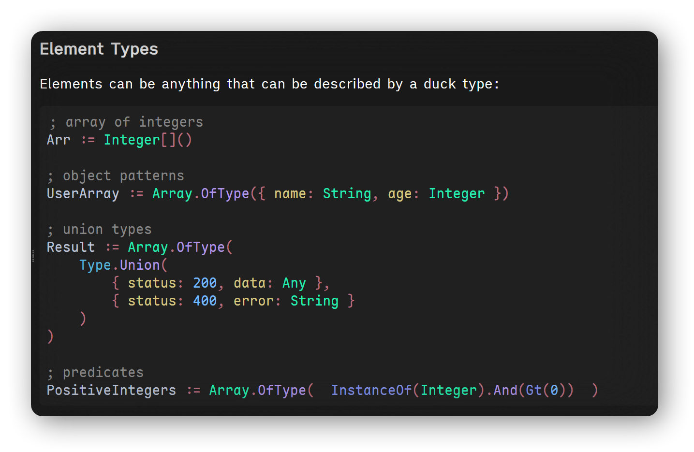

[AquaHotkey](https://github.com/0w0Demonic/AquaHotkey) is the framework that unleashes the full power of the AutoHotkey object model, allowing you to extend user-defined and built-in objects and dynamically add to or modify their behavior; adds the ability to write programs in a functional style; extends the standard library with new types and containers; adds structures for working with data; adds type safety; demonstrates how OOP works.


To build documentation from `*.md` files into `*.html`, install [Pandoc](https://pandoc.org) and run [aquahotkey_docset.py](aquahotkey_docset.py). To check all links and hyperlinks, use [check_links.py](check_links.py). There is a [helper filter](md-to-html.lua) for Pandoc, that replaces all `.md` links to `.html` (because docset is a bundle of `.html` files).

The [test](test/) folder contains tools for verifying the conversion of AutoHotkey code into readable HTML. Specifically, it contains [KDE syntax highlighting](https://docs.kde.org/stable_kf6/en/kate/katepart/highlight.html) file named [ahk.xml](ahk.xml) for AutoHotkey that can be passed to Pandoc to add syntax highlighting to any AutoHotkey code:

```powershell
Split-Path -Parent $PSCommandPath | Set-Location
pandoc.exe syntax.ahk `
    --output syntax.html `
    --from gfm --to html5 `
    --standalone `
    --syntax-definition ../ahk.xml `
    --css ../style.css `
    --wrap none
```

You can verify it's schema using [ahk.xsd](ahk.xsd). There's few files to verify HTML output:

- [syntax.ahk](syntax.ahk)

- [nested.ahk](nested.ahk)

- [jsdoc.ahk](jsdoc.ahk)

Make sure that output from Pandoc looks readable



